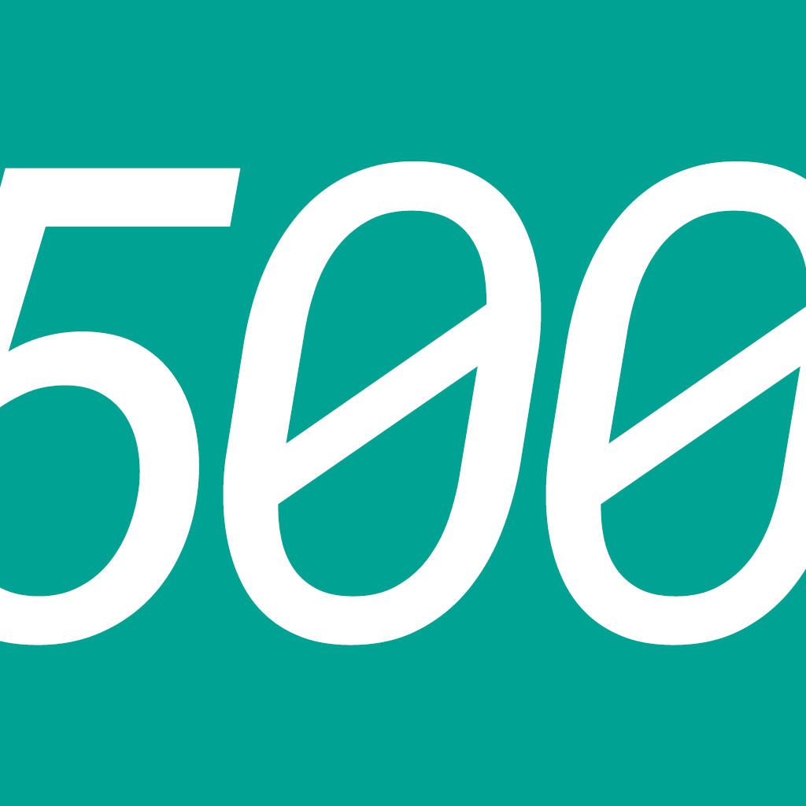
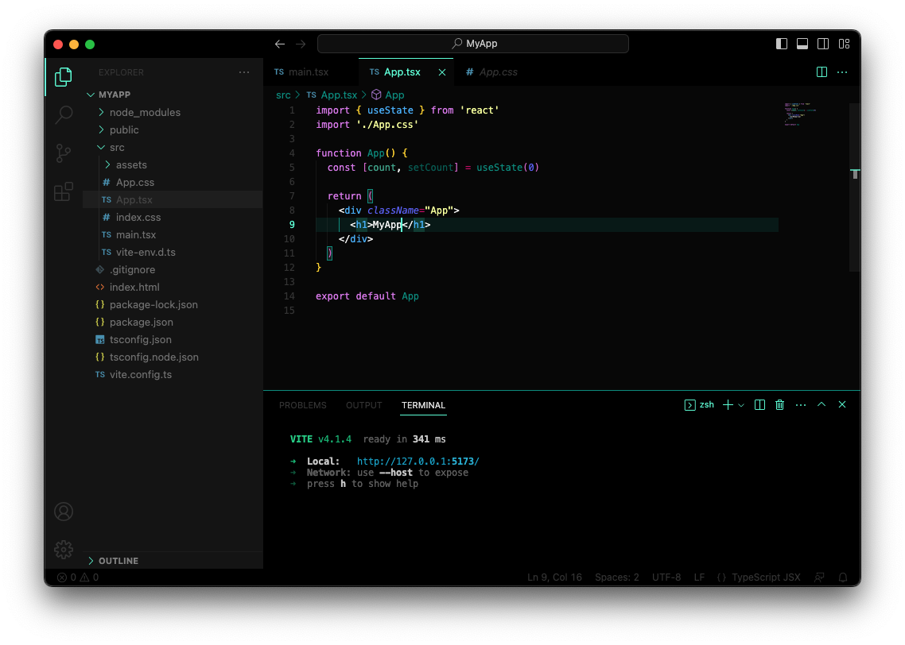

<h1 align="center">
   
    
   
   
  green500
   
   
</h1>

<h4 align="center">The revolution of your code with a dark, green and modern theme</h4>

  
  

> Get a new development experience with this theme based on style guide by lawtech [Sem Processo](https://www.semprocesso.com.br/).

 
 

## What's new?

Click here to go to the [Changelog](CHANGELOG.md)

## License
[GNU General Public License v3.0](LICENSE)