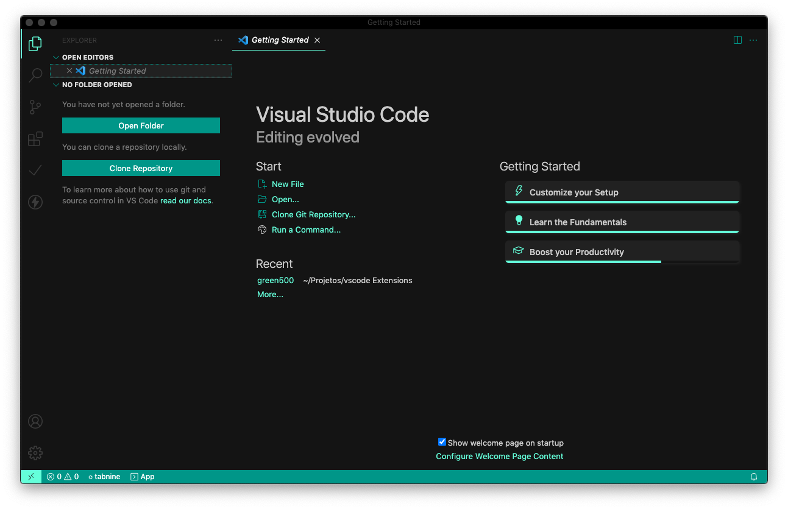

<h1 align="center">
   
    
   
   
  green500
   
   
</h1>

<h4 align="center">Get the experience of development in the Sem Processo style</h4>

  
  

> 📣  This theme is inspired by the lawtech [Sem Processo](https://www.semprocesso.com.br/) style guide.  
> ❗️ Under construction

 

# REMOVER

A VS Code extension to debug web applications and extensions running in the [Mozilla Firefox browser](https://www.mozilla.org/en-US/firefox/developer/?utm_medium=vscode_extension&utm_source=devtools). [📦 Install from VS Code Marketplace](https://marketplace.visualstudio.com/items?itemName=firefox-devtools.vscode-firefox-debug).

### Supported features

* Pause [breakpoints](https://code.visualstudio.com/docs/editor/debugging#_breakpoints), including advanced [conditional](https://code.visualstudio.com/docs/editor/debugging#_conditional-breakpoints) and [inline](https://code.visualstudio.com/docs/editor/debugging#_inline-breakpoints) modes
* Pause on object property changes with [Data breakpoints](https://code.visualstudio.com/docs/editor/debugging#_data-breakpoints)
* Inject logging during debugging using [logpoints](https://code.visualstudio.com/docs/editor/debugging#_logpoints)
* Debugging eval scripts, script tags, and scripts that are added dynamically and/or source mapped
* *Variables* pane for inspecting and setting values
* *Watch* pane for evaluating and watching expressions
* *Console* for logging and REPL
* Debugging Firefox extensions
* Debugging Web Workers
* Compatible with [remote development](https://code.visualstudio.com/docs/remote/remote-overview)

## Getting Started

You can use this extension in **launch** or **attach** mode.

In **launch** mode it will start an instance of Firefox navigated to the start page of your application
and terminate it when you stop debugging. You can also set the `reAttach` option in your launch configuration to `true`, in this case Firefox won't be terminated at the end of your debugging session and the debugger will re-attach to it when
you start the next debugging session - this is a lot faster than restarting Firefox every time. `reAttach` also works for WebExtension debugging: in this case, the WebExtension is (re-)installed as a [temporary add-on](https://developer.mozilla.org/en-US/Add-ons/WebExtensions/Temporary_Installation_in_Firefox).
